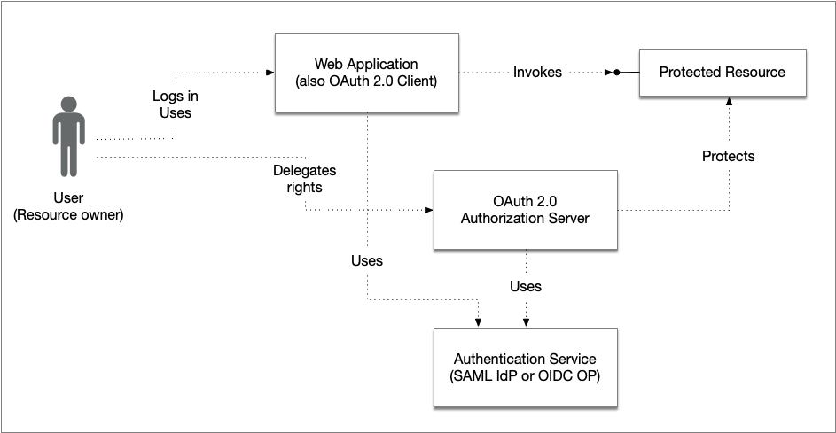
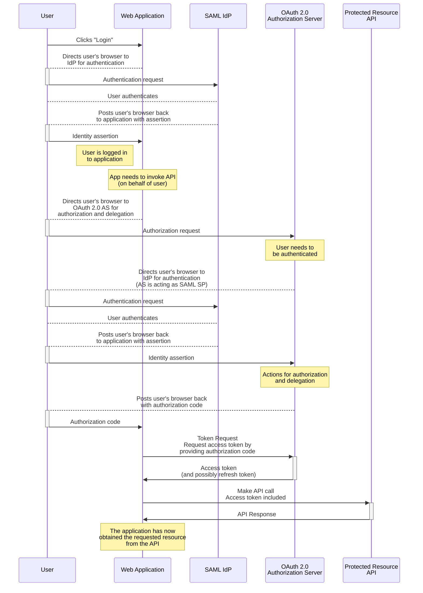
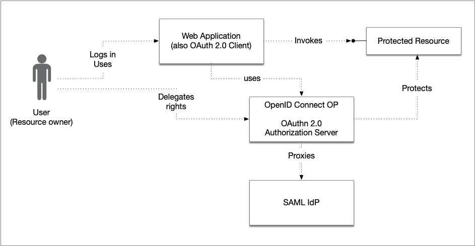
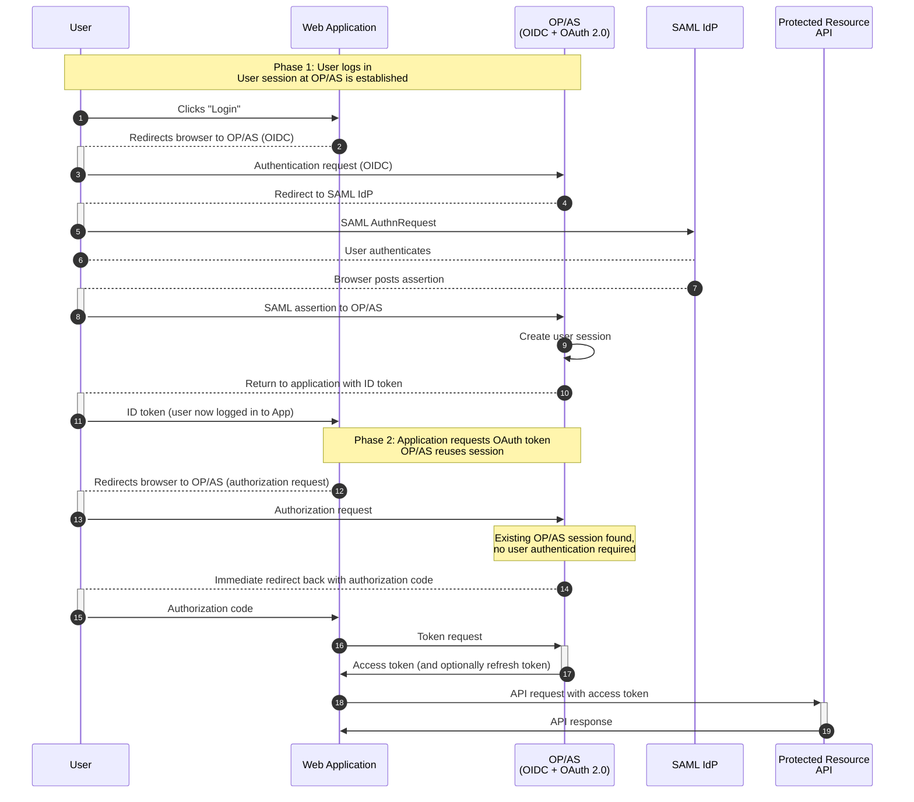
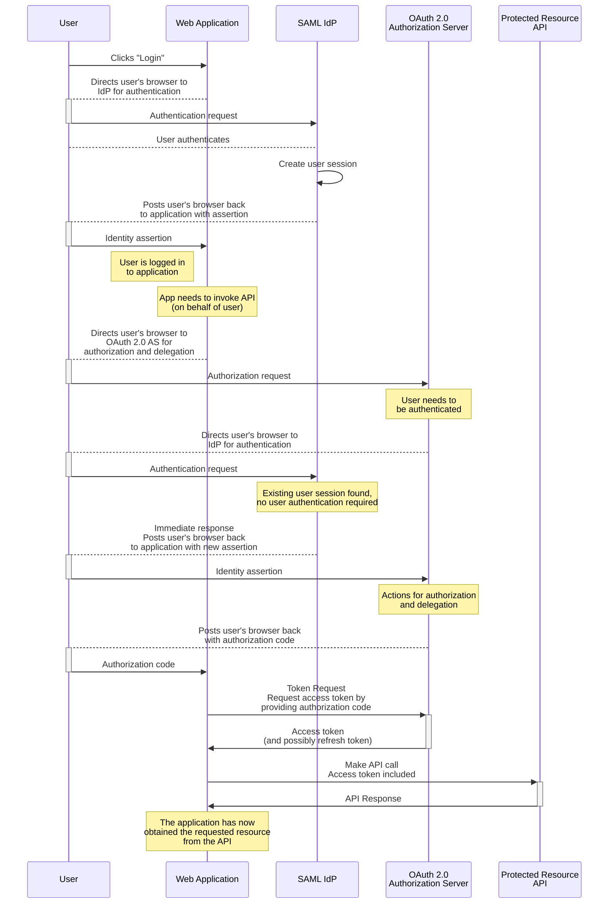

# Ena OAuth 2.0 User Authentication Best Practices

### Version: 1.0 - draft 01 - 2025-09-03

## Abstract

The OAuth 2.0 framework defines mechanisms that allow users (resource owners) to delegate access rights to a protected resource for an application they are using. Additionally, OAuth 2.0 protocols are often used without user involvement in service-to-service scenarios.

In many cases, a user is already logged in to a web application (which also acts as an OAuth 2.0 client) before the first request to the OAuth 2.0 authorization server is made. Since we want a smooth user experience, we do not want the user to have to authenticate again at the authorization server. This document provides best practices for how to integrate application-level user authentication with an OAuth 2.0 deployment.

## Table of Contents

1. [**Introduction**](#introduction)

    1.1. [Problem Description](#problem-description)

2. [**Recommended Solutions**](#recommended-solutions)

    2.1. [Combining Authentication and Authorization Servers into a Single Component](#combining-authentication-and-authorization-server)

    2.1.1. [Migration via Proxy for an Existing SAML IdP](#migration-via-proxy-for-an-existing-saml-idp)
    
    2.1.2. [Supporting Both SAML and OAuth 2.0/OpenID Connect](#supporting-both-saml-and-oauth-oidc)

    2.1.3. [Benefits](#benefits)
    
    2.1.4. [Illustration of the Combined Model](#illustration-of-the-combined-model)

    2.2. [Using Single Sign-On Capabilities](#using-single-sign-on-capabilities)

    2.3. [Client Provides Identity Assertion](#client-provides-identity-assertion)
    
3. [**References**](#references)

## 1. Introduction

When a user is directed to the authorization server from a client (for example, a web application) in order to delegate certain rights to that client, the OAuth 2.0 protocol requires that the authorization server authenticate the user before proceeding with user consent and any further actions aimed at issuing an access token for the client.

That the authorization server needs to know which user it should delegate rights for is obvious, but how this authentication is actually performed is out of scope for the OAuth 2.0 specifications. 

In many real-life scenarios, the user has already authenticated and logged in to the web application before the application acts as an OAuth client and redirects the user to the authorization server. In security domains where authentications are session-bound and “remember me” functionality is not used, this may mean that the user has to authenticate twice: once when logging in to the web application and again when being redirected to the authorization server.

If the web application and the authorization server use the same type of user authentication, for example, they both use the same identity provider and they both require the same user identity attributes and authentication context for authenticating a user, there are methods to apply where the user only (visibly) authenticates once. 

This document provides best practices for user authentication in OAuth 2.0 when end users log in to the  web application (which is the OAuth 2.0 client) before the OAuth 2.0 flow starts.

The document presents a number of approaches to solving the above problem, some of which are considered more favourable. The approach chosen for a particular deployment depends on its ability to adapt and make the necessary changes.

However, certain prerequisites must be met for the recommendations in this document to be valid:

- The web application and the OAuth 2.0 authorization server must maintain a consistent "view" of their users with respect to authentication. This requires them to share a common set of requirements regarding assurance levels and identity attributes. In theory, this means that the user typically authenticates with the same eID for both the web application and the authorization server. In practice, however, the same eID may not be sufficient, since some identity providers also release attributes such as roles and assignments. In such cases, the requirement is that both the web application and the authorization server use the same identity provider.

- The authentication services or modules used by the web application and the OAuth 2.0 authorization server should be externalized rather than tightly integrated. For example, they may be a SAML Identity Provider or an OpenID Provider.

### 1.1. Problem Description

This section illustrates the problem that the document aims to address and discusses various conditions that an organization may encounter. 

The picture above illustrates the actors that are referred to in this document.

<dl>
<dt>User</dt>
<dd>
The user, or resource owner, that logs in to the web application and also delegates its rights to the web application for access to the protected resource.
</dd>
<dt>Web application</dt>
<dd>
The web application to which the user logs into. The web application directs the user to the authentication service for authentication. After the user has logged in, the web application wants to access the protected resource obtaining data that the user owns, or has access rights to. Usually, this resource is an API backend service. In order to access the protected resource on behalf of the user the web application needs to act as an OAuth 2.0 client and obtain an access token from the OAuth 2.0 authorization server.
</dd>
<dt>Protected resource</dt>
<dd>
The service that exposes an API from where the web application requests resources. This service is configured to require a valid OAuth 2.0 access token in order to grant access and is thus acting as an OAuth 2.0 protected resource.
</dd>
<dt>OAuth 2.0 Authorization server</dt>
<dd>
The OAuth 2.0 authorization server used by the web application (client). It protects the API (protected resource) and authenticates its users by delegating the authentication to the authentication service.
</dd>
<dt>Authentication service</dt>
<dd>
An authentication service to which the web application and OAuth 2.0 authorization server delegates user authentication to. This service may be a SAML Identity Provider or an OpenID Connect Provider, or even a service implementing another protocol. The service may offer one, or several, authentication methods, or may act as a proxy service for other authentication services. 
</dd>
</dl>

The below sequence diagram illustrates a flow where the user has to authenticate twice. In this example the authentication service is an SAML Identity Provider and the OAuth 2.0 authorization code flow is being used.

## 2. Recommended Solutions

This section presents a set of solutions to the problem described above, ordered from the most favourable architecture and solution pattern to the least favourable. The choice of solution depends on factors such as the ability to modify existing systems, other application integration patterns, and, of course, cost. 

### 2.1. Combining Authentication and Authorization Servers into a Single Component

One way to avoid duplicate user authentication is to consolidate the roles of authentication and authorization into a single component. In such a deployment, an OpenID Provider (which is, by definition, an OAuth 2.0 authorization server) fronts the user authentication process and also issues OAuth 2.0/OIDC tokens. The combined system provides user authentication for OAuth transactions, either by authenticating users directly or by acting as a proxy against an external identity provider. 

The combined service therefore acts as an OpenID Provider during user authentication, or as a SAML Identity Provider (see [Section 2.1.2](#supporting-both-saml-and-oauth-oidc)), and as an OAuth 2.0 Authorization Server for authorization and delegation requests.

This model reduces architectural complexity and minimises the number of browser redirects, resulting in a smoother user experience. It is well suited to environments where a central component governs both sign-in and token issuance with consistent policies for assurance, claims, and session management.

#### 2.1.1. Migration via Proxy for an Existing SAML IdP

Organisations that currently rely on a standalone SAML Identity Provider can transition incrementally by introducing a modern component that acts as both OpenID Provider and OAuth 2.0 authorization server while proxying authentication to the existing SAML IdP:

1. **Introduce an OP/AS in front of the SAML IdP.** Configure the new component as a SAML Service Provider towards the “old” IdP, and as an OpenID Provider/OAuth authorization server towards applications.

2. **Preserve assurance and context.** Map the SAML representation of authentication context (`AuthnContextClassRef`) to the corresponding OpenID Connect value (`acr`). Ensure that SAML identity attributes are translated into OpenID Connect claims without any loss of meaning. 

3. **Align sessions.** Decide how the OP/AS session relates to the upstream SAML session (e.g., honour SSO from the IdP, set OP session lifetimes, and define idle/absolute timeouts). Also, possibly plan for front-channel and/or back-channel logout to avoid surprises.

4. **Register applications/clients and scopes.** Move applications to use the OP/AS for OAuth 2.0/OpenID Connect. Define scopes and claims that reflect what the API actually needs, and align token lifetimes with risk posture.

Also, consider the following:

- **Roll out safely.** Migrate low-risk applications first, keep a fallback to direct SAML where necessary, monitor user experience and error rates, then phase out legacy direct integrations.  

- **Harden and observe.** Enable centralised auditing, risk signals, step-up policies, and anomaly detection at the OP/AS layer before decommissioning legacy paths.  

The overview picture in [Section 1.1](#problem-description) can now be redrawn as:

#### 2.1.2. Supporting Both SAML and OAuth 2.0/OpenID Connect

Some products, such as Keycloak, can be configured to act both as a SAML Identity Provider and as an OAuth 2.0 Authorization Server/OpenID Connect Provider at the same time. This flexibility allows organisations to support SAML-based applications that are not yet ready to migrate, while introducing OAuth 2.0 and OpenID Connect for newer applications and APIs.  

Running both protocols side by side provides a practical migration strategy: existing applications can continue to authenticate via SAML, while new applications use OpenID Connect. Over time, SAML integrations can be phased out when appropriate, without forcing an immediate switch for all consumers.

Note: It is also possible to configure a Keycloak instance to act as a SAML Identity Provider and an OAuth 2.0 authorization server without introducing OpenID Connect as the authentication protocol. In such cases, the Keycloak IdP would proxy authentication to the “old” IdP as described in the previous section.

#### 2.1.3. Benefits

By combining the authentication and authorization services, several benefits can be achieved:  

- **Simplified architecture:** a single policy enforcement point for sign-in, session, and token issuance.  
- **Reduced user friction:** fewer redirects and fewer visible authentications.  
- **Consistent policy:** uniform handling of assurance levels, attributes/claims, and consent.  
- **Incremental adoption:** a legacy SAML IdP can remain in place while applications migrate, or continue to serve as the authenticator used by the combined service.  
- **Mixed-protocol support:** both SAML and OIDC clients can coexist during transition.  

#### 2.1.4. Illustration of the Combined Model

The diagram below shows the improved flow compared to the double-login example in [Section 1.1](#problem-description). In this case, the combined authentication and authorization server establishes a user session when the user logs in, and no further authentication is required for subsequent OAuth calls.

### 2.2. Using Single Sign-On Capabilities

When both the web application and the authorization server delegate authentication to the same identity provider, Single Sign-On (SSO) can often be leveraged. By relying on a shared authentication session at the identity provider, both systems can recognise that the user has already been authenticated and avoid asking for credentials again.

The main advantage of this approach is its low cost and high usability. Users experience a seamless flow where authentication performed once is transparently reused by both the web application and the authorization server. From an implementation perspective, this method requires minimal additional configuration if the identity provider supports SSO and exposes consistent sessions across relying parties.

However, this solution is not always feasible. Some identity providers either lack proper SSO support or enforce user interaction (such as a mandatory confirmation step) even when a valid authentication session exists. In such cases, the user may still encounter repeated prompts, reducing the overall benefit.

Despite these limitations, using SSO is often a good solution whenever the technical prerequisites are met, since it combines simplicity with a good user experience.

Depending on how the identity provider operates, there may be scenarios where an OAuth 2.0 authorization request needs to include additional information in order for SSO to work. For example, the web application may allow the user to choose between several identity providers during login. In such cases, the web application must indicate which IdP holds the user session when sending the OAuth 2.0 authorization request. See Section 5.1.1.1 of \[[Ena.OAuth2.Profile](#ena-oauth2-profile)\].

The sequence diagram below is similar to the one in [Section 1.1](#problem-description), with the important difference that the user only needs to authenticate once.

### 2.3. Client Provides Identity Assertion

Another method is for the web application itself to provide an identity assertion to the authorization server. In this model, the user authenticates to the web application first. The web application then issues a signed assertion, typically in the form of a SAML assertion, OpenID Connect ID token, or a token issued by an external identity provider, that is presented to the authorization server as proof of the user’s identity.

The authorization server validates the assertion and, if it meets the configured assurance requirements, accepts it as fulfilling the user authentication step within the OAuth 2.0 flow.

This approach is more complex to implement, as it requires secure token exchange and trust relationships between the web application, the identity provider, and the authorization server. However, it provides flexibility in cases where SSO is not available or when stronger control over authentication context and assurance levels is required.

A common pattern is to use the SAML 2.0 Bearer Assertion Grant, \[[RFC7522](#rfc7522)\]. The same pattern can also be applied with OAuth 2.0 Token Exchange, \[[RFC8693](#rfc8693)\], when an OpenID Connect ID token is used. See Section 5.4.1 of \[[Ena.OAuth2.Profile](#ena-oauth2-profile)\] for requirements on how to use \[[RFC7522](#rfc7522)\].

While more demanding in terms of configuration, the identity assertion model ensures that the authorization server can rely on the authentication already performed by the web application, thus eliminating duplicate logins for the end user.

Some drawbacks of this method include:  

- It creates additional trust dependencies and is generally not suitable for intra-organisation use.
- It requires the IdP/OP to be aware of all audiences where the tokens will be used.
- It prevents the establishment of a user session at the OAuth 2.0 authorization server.
- Tokens must be exchanged immediately after being received by the application/client, since SAML and OIDC tokens are short-lived.

Therefore, this solution may be used in very specific cases, but it should be considered a last resort.

## 3. References

**\[Ena.OAuth2.Profile\]**
> [Ena OAuth 2.0 Interoperability Profile](https://github.com/ena-infrastructure/specifications/blob/main/ena-oauth2-profile.md)

**\[RFC7522\]**
> [Campbell, B., Mortimore, C., and M. Jones, "Security Assertion Markup Language (SAML) 2.0 Profile for OAuth 2.0 Client Authentication and Authorization Grants", RFC 7522, DOI 10.17487/RFC7522, May 2015](https://datatracker.ietf.org/doc/html/rfc7522).

**\[RFC8693\]**
> [Jones, M., Campbell, B., and D. Waite, "OAuth 2.0 Token Exchange", RFC 8693, DOI 10.17487/RFC8693, January 2020](https://www.rfc-editor.org/info/rfc8693).

